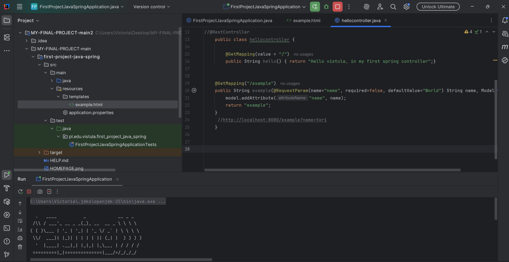

Spring MVC Greeting App

This code is a simple MVC pattern code using HTML and Java.

Features
-Displays text
-Displays an image
-Follows the MVC pattern using Thymeleaf templates

How to Run
1. Clone the repo:
   git clone https://github.com/your-username/spring-mvc-greeting-app.git
2. Open in IntelliJ as a Maven project.
3. Run `FirstProjectJavaSpringApplication.java`.
4. Visit: `http://localhost:8080/example?name=Tori`

##  Screenshots
### PROGRAM OPRATION
![OPRATION Screenshot]!

##  Screenshots
### PROGRAM OPRATION
![OPRATION Screenshot]!

**programs used**
- Java 
- Spring Boot
- Spring MVC
- Thymeleaf
- Maven
